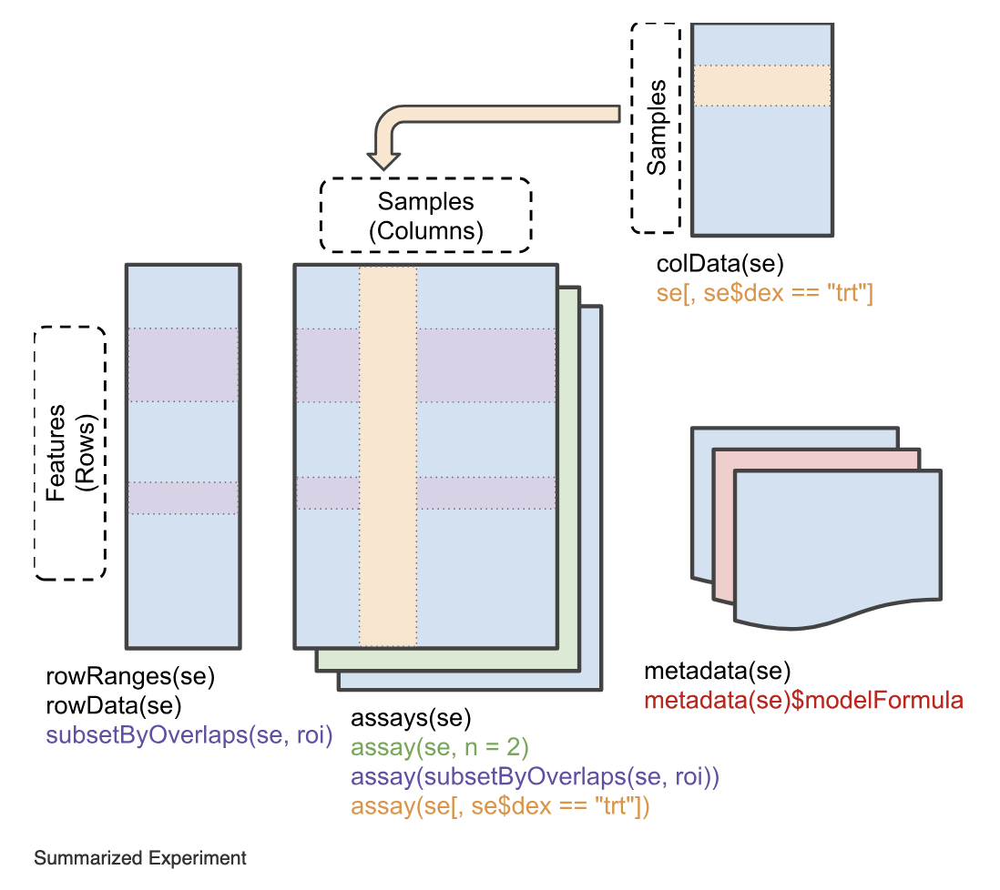
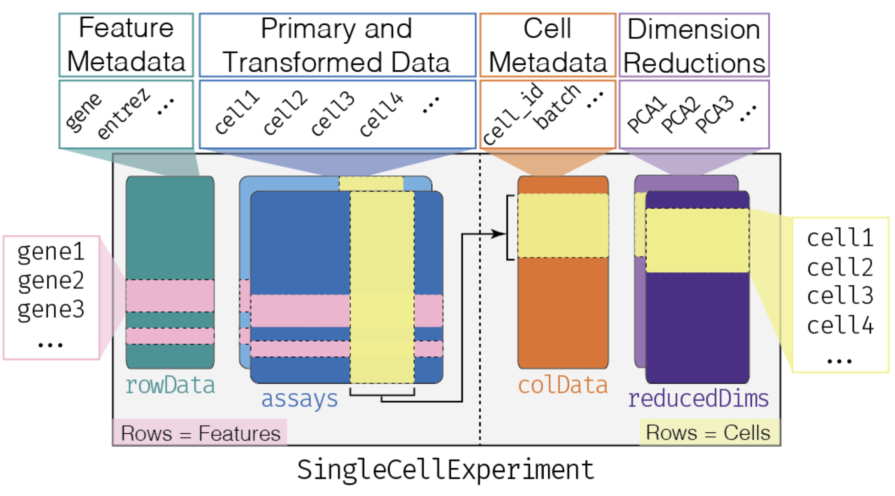

```{r, include = FALSE}
knitr::opts_chunk$set(
  echo = TRUE,
  cache = FALSE,
  collapse = TRUE,
  comment = "#>",
  crop = NA
)
```

```{r, eval=!exists("SCREENSHOT"), include=FALSE}
SCREENSHOT <- function(x, ...) knitr::include_graphics(x)
```


# Streamlining Omics Data Visualization with `iSEE` and `iSEEfier`

## Introduction to `iSEE`

The `r BiocStyle::Biocpkg("iSEE")` package is a flexible, powerful and extendible application to explore and visualize any omics datas, including single cell and spatially resolved data.

### Input data

`r BiocStyle::Biocpkg("iSEE")` was designed around the `r BiocStyle::Biocpkg("SummarizedExperiment")` class, a container widely used throughout the *Bioconductor* project. Briefly, the `r BiocStyle::Biocpkg("SummarizedExperiment")` class provides a container keeping matrices of assay data, sample metadata, and feature metadata.



In this workshop we will use a demonstration dataset of single cell RNAseq from Tasic et al. (2016) "Adult mouse cortical cell taxonomy revealed by single cell transcriptomics" [doi:10.1038/nn.4216](https://doi.org/10.1038/nn.4216)[@Tasic2016-ga].  
The data is made available via the `r BiocStyle::Biocpkg("scRNAseq")` Bioconductor package, and is stored in an object of class `r BiocStyle::Biocpkg("SingleCellExperiment")`, which is a class that inherits from the `SummarizedExperiment` class. It includes additional slots and methods like metadata related to individual cells and their associated dimensionality reductions.




We processed the data beforehand to save some time.

```{r loadlib, message=FALSE,warning=FALSE}
library("iSEEfierWorkshopSCBS2024")
```

```{r loaddata}
sce <- iSEEfierWorkshopSCBS2024::sce_allen
sce
```

Looking at the object displayed above, we can tell that it contains:

-   Two `assays`. The first one called `counts`, and corresponds to a matrix measuring 20,816 genes in 379 cells. And The second assay is `logcounts`, which is the log transformed counts.
-   Twenty-three columns of cell metadata (`colData`).
-   No gene metadata (`rowData`), but only the basic information in the `rownames`.
-   Three reduced dimensions : `PCA`, `TSNE`, and `UMAP`.

Also of note:

-   Gene symbols are in use for the row names.
-   Arbitrary cell names are in use for column names (related to the SRA run information).
-   Some object-level metadata is present.
-   An alternative experiment called `ERCC` is present (we will not use it) - this is related to the [ERCC Spike-in mix](https://www.thermofisher.com/order/catalog/product/de/en/4456740).

### The default `iSEE` app

Now we can launch an `r BiocStyle::Biocpkg("iSEE")` instance and start exploring this dataset using the `iSEE()` function without any further argument. This will produce an app using the default configuration; that is, the app instance will include one panel of each built-in class for which the relevant information is available in the `SingleCellExperiment` object.

```{r createApp}
app <- iSEE::iSEE(sce)
```

```{r launchApp, message=FALSE, eval=FALSE}
shiny::runApp(app,launch.browser = TRUE)
```

```{r, echo=FALSE, out.width='100%'}
# don't run
SCREENSHOT("img/iSEE_default.png", delay = 10)
```

### The built-in panel types

#### `ReducedDimensionPlot`

The reduced dimension plot can display any reduced dimension representation that is present in the `reducedDim` slot of the `SingleCellExperiment` object.

Note that this slot is not defined for the base `SummarizedExperiment` class, in which case the user interface does not allow the inclusion of panels of this type.

```{r reddim, message=FALSE, echo = FALSE}
app <- iSEE::iSEE(sce, initial = list(ReducedDimensionPlot(PanelWidth = 12L)))
```

```{r, message=FALSE, eval=FALSE}
shiny::runApp(app,launch.browser = TRUE)
```

```{r, echo=FALSE, out.width='70%', fig.align='center'}
# don't run
SCREENSHOT("img/iSEE_RedDimPlot.png", delay = 10)
```


#### `ColumnDataPlot`

The column data plot can display one or two of the provided column annotations (from the `colData` slot). Depending on the class of the selected annotations, the panel shows either a scatter plot, a violin plot, or a Hinton diagram [@Hinton1991-hintondiagram; @Bremner1994-hintonplots].

```{r coldata, message=FALSE, echo = FALSE}
app <- iSEE::iSEE(sce, initial = list(ColumnDataPlot(PanelWidth = 12L)))
```

```{r, message=FALSE, eval=FALSE}
shiny::runApp(app,launch.browser = TRUE)
```

```{r, echo=FALSE, out.width='70%', fig.align='center'}
# don't run
SCREENSHOT("img/iSEE_ColDataPlot.png", delay = 10)
```

#### `ComplexHeatmapPlot`

The complex heatmap panel displays, for any assay, the observed values for a subset of the features across the samples.

```{r heatmap, message=FALSE, echo = FALSE}
app <- iSEE::iSEE(sce, initial = list(ComplexHeatmapPlot(PanelWidth = 12L)))
```

```{r, message=FALSE, eval=FALSE}
shiny::runApp(app,launch.browser = TRUE)
```

```{r, echo=FALSE, out.width='70%', fig.align='center'}
# don't run
SCREENSHOT("img/iSEE_Heatmap.png", delay = 10)
```

#### `FeatureAssayPlot`

The feature assay plot displays the observed values for one feature across the samples. It is also possible to plot the observed values for two features, in a scatter plot.

```{r featureassay, message=FALSE, echo = FALSE}
app <- iSEE::iSEE(sce, initial = list(FeatureAssayPlot(PanelWidth = 12L)))
```

```{r, message=FALSE, eval=FALSE}
shiny::runApp(app,launch.browser = TRUE)
```

```{r, echo=FALSE, out.width='70%', fig.align='center'}
# don't run
SCREENSHOT("img/iSEE_FeatureAssayPlt.png", delay = 10)
```

#### `SampleAssayPlot`

Analogous to the [`r .fullName(FeatureAssayPlot())`](#featassayplot) above, the `r .fullName(SampleAssayPlot())` shows the observed values for all features, for one of the samples. It is also possible to plot the observed values for two samples, in a scatter plot.

```{r sampleassay, message=FALSE, echo = FALSE}
app <- iSEE::iSEE(sce, initial = list(SampleAssayPlot(PanelWidth = 12L)))
```

```{r, message=FALSE, eval=FALSE}
shiny::runApp(app,launch.browser = TRUE)
```

```{r, echo=FALSE, out.width='70%', fig.align='center'}
# don't run
SCREENSHOT("img/iSEE_SampleAssayPlt.png", delay = 10)
```

#### `RowDataTable` 

The row data table displays all information provided in the `rowData` slot of the `SummarizedExperiment` object, leveraging the interactivity provided by the `r BiocStyle::CRANpkg("DT")` package.

```{r rowdatatab, message=FALSE, echo = FALSE}
app <- iSEE::iSEE(sce, initial = list(RowDataTable(PanelWidth = 12L)))
```

```{r, message=FALSE, eval=FALSE}
shiny::runApp(app,launch.browser = TRUE)
```

```{r, echo=FALSE, out.width='70%', fig.align='center'}
# don't run
SCREENSHOT("img/iSEE_RowDataTable.png", delay = 10)
```

#### `ColumnDataTable`

Analogous to the [`r .fullName(RowDataTable())`](#rowdatatable) above, the column data table displays all information provided in the `colData` slot of the `SummarizedExperiment` object.

```{r coldatatab, message=FALSE, echo = FALSE}
app <- iSEE::iSEE(sce, initial = list(ColumnDataTable(PanelWidth = 12L)))
```

```{r, message=FALSE, eval=FALSE}
shiny::runApp(app,launch.browser = TRUE)
```

```{r, echo=FALSE, out.width='70%', fig.align='center'}
# don't run
SCREENSHOT("img/iSEE_ColDataTable.png", delay = 10)
```

### Collapsible boxes with display controls

#### Data parameters

Each plot panel type has a `Data parameters` collapsible box. This box has different content for each panel type, but in all cases it lets the user control the data that is displayed in the plot.

```{r datapram, message=FALSE, echo = FALSE}
app <- iSEE::iSEE(sce, initial = list(ColumnDataPlot(PanelWidth = 12L,
                                                     DataBoxOpen = TRUE)))
```

```{r, message=FALSE, eval=FALSE}
shiny::runApp(app,launch.browser = TRUE)
```

```{r, echo=FALSE, out.width='70%', fig.align='center'}
# don't run
SCREENSHOT("img/iSEE_data_param.png", delay = 10)
```


#### Visual parameters

In contrast to the `Data parameters` collapsible box that lets users control *what* is displayed in the plot, the `Visual parameters` box lets users control *how* the information is displayed.

This collapsible box contains the controls to change the size, shape, opacity, and color of the points, to facet the plot by any available categorical annotation, to subsample points for increased speed of plot rendering, and to control how legends are displayed.

```{r vizparam, message=FALSE, echo=FALSE}
app <- iSEE::iSEE(sce, initial = list(FeatureAssayPlot(PanelWidth = 12L,
                                                     VisualBoxOpen = TRUE)))
```

```{r, message=FALSE, eval=FALSE}
shiny::runApp(app,launch.browser = TRUE)
```

```{r, echo=FALSE, out.width='70%', fig.align='center'}
# don't run
SCREENSHOT("img/iSEE_viz_param.png", delay = 10)
```

#### Selection parameters

The `Selection parameters` collapsible box provides controls to transfer selections of points (features or samples) between panels.

We demonstrate examples of point transmission in the separate vignette of [workshop recipes](recipes.html)

```{r selecparam, message=FALSE, echo = FALSE}
app <- iSEE::iSEE(sce, initial = list(ReducedDimensionPlot(PanelWidth = 12L,
                                                           Type = "TSNE",
                                                           SelectionBoxOpen = TRUE)))
```

```{r, message=FALSE, eval=FALSE}
shiny::runApp(app,launch.browser = TRUE)
```

```{r, echo=FALSE, out.width='70%', fig.align='center'}
# don't run
SCREENSHOT("img/iSEE_selec_param.png", delay = 10)
```

## Introduction to `iSEEfier`

Now we have seen how powerful of a tool `iSEE` can be. As we previously learned, many tasks can be accomplished simply by running the command:

```{r, eval=FALSE}
iSEE(sce)
```

However, customizing our visualization session can be cumbersome, as it may require adding or removing different panels based on our needs. This process often includes multiple steps, such as selecting a gene of interest or coloring by a specific `colData`, and may even involve writing multiple lines of code.

To make this process simpler, we can use the `r BiocStyle::Biocpkg("iSEEfier")` package, which streamlines the setup (or if you will, firing up) of an `iSEE` instance with just a small chunk of code, avoiding the need to configure each `iSEE` panel individually.

In this section, we will illustrate a simple example of how to use `r BiocStyle::Biocpkg("iSEEfier")`. We will use the same allen data we worked with during this workshop.

#### `iSEEinit`

For example, we can be interested in visualizing the expression of *Bcl6*, *Arf5*, *Cxcr5* and *Grip1* genes all at once. We start by providing a couple of parameters:

```{r setup_iSEEinit}
## Define the list of genes
feature_list_1 <- c("Bcl6", "Arf5", "Cxcr5","Grip1")

## Define the cluster/cell type 
cluster_1 <- "Primary.Type"
```

It is also possible to load the feature list as a `data.frame`, if our genes of interest already existed in a table.
Now we can pass these parameters into `iSEEinit()` to create a customized initial configuration:

```{r iSEEinit}
## Create an initial state with iSEEinit
initial_1 <- iSEEinit(sce,
                      features = feature_list_1,
                      clusters = cluster_1,
                      add_markdown_panel = TRUE)
```

The rest can be as easy as passing this initial to the `iSEE()` call:

```{r, message=FALSE, echo=FALSE}
app <- iSEE::iSEE(sce, initial = initial_1)
```

```{r, message=FALSE, eval=FALSE}
shiny::runApp(app,launch.browser = TRUE)
```

This is how it would look like:

```{r, echo=FALSE, out.width='100%'}
SCREENSHOT("img/isee-on-fier.png", delay = 10)
```

While we are visualizing the expression of these genes, we might want to take some notes (gene X is more expressed in a certain cell type/cluster than some others, maybe we are trying to annotate the cells ourselves if the annotation wasn't available...).  
For this, we used the argument `add_markdown_panel = TRUE`. It will display a `MarkdownBoard` panel where we can note our observations without leaving the app.

#### `iSEEmarker`

In many cases, we are interested in determining the identity of our cell clusters, or further subset our cells types. That's where `iSEEmarker()` comes in handy. Similar to `iSEEinit()`, we need a couple of parameters to be set:

```{r setup_iSEEmarker}
## Define the cluster/cell type 
cluster_1 <- "Primary.Type"

## Define the groups/conditions
group_1 <- "driver_1_s"
```

```{r iSEEmarker}
initial_2 <- iSEEmarker(
  sce = sce,
  clusters = cluster_1,
  groups = group_1,
  selection_plot_format = "ColumnDataPlot")
```

This function returns a list of panels, with the goal of visualizing the expression of
marker genes selected from the `DynamicMarkerTable` in each cell cell type. Unlike `iSEEinit()`, which requires us to specify a list of genes, `iSEEmarker()` utilizes the `DynamicMarkerTable`, a custom panel in `iSEE`, that performs statistical testing through the `findMarkers()` function from the `r BiocStyle::Biocpkg("scran")` package.
To start exploring the marker genes of each cell type with `iSEE`, we run as usual:

```{r, message=FALSE, echo=FALSE}
app <- iSEE::iSEE(sce, initial = initial_2)
```

```{r, message=FALSE, eval=FALSE}
shiny::runApp(app,launch.browser = TRUE)
```

This is how it would look like:

```{r, echo=FALSE, out.width='100%'}
SCREENSHOT("img/iSEEmarker.png", delay = 10)
```

#### `iSEEnrich`

At times, it can be useful to explore particular sets of features and their associated genes. This is where `iSEEnrich` proves to be especially valuable. We will first set up the necessary arguments:

```{r set_iSEEnrich}
## Set which terms to use
GO_collection <- "GO"

## Set the organism via the orgDb package name
Mm_organism <- "org.Mm.eg.db"

## Set the gene identifier type
gene_id <- "SYMBOL"

## Define the cluster info
cluster_1 <- "Primary.Type"
## Define the group info
group_1 <- "driver_1_s"
## Define the plot type for the reduced dimension
reddim_type <- "TSNE"
```

Now let's create this initial setup for `iSEE` using `iSEEnrich()`

```{r iSEEnrich}
results <- iSEEnrich(
  sce = sce,
  collection = GO_collection,
  gene_identifier = gene_id,
  organism = Mm_organism,
  clusters = cluster_1,
  reddim_type = reddim_type,
  groups = group_1
)
```

`iSEEnrich` will specifically return a list with the updated `sce` object and
its associated `initial` configuration. To start the `iSEE` instance we run:

```{r, message=FALSE, echo=FALSE}
app <- iSEE::iSEE(results$sce, initial = results$initial)
```

```{r, message=FALSE, eval=FALSE}
shiny::runApp(app,launch.browser = TRUE)
```

This is how it would look like:

```{r, echo=FALSE, out.width='100%'}
SCREENSHOT("img/iSEEnrich.png", delay = 10)
```

#### `view_initial_*`

We can check the initial's content, or how the included panels are linked between each other without running the app with `view_initial_tiles()` and `view_initial_network()`:

```{r fig.width=7, fig.height=5}
## Display a graphical representation of the initial configuration, where the panels are identified by their corresponding colors
view_initial_tiles(initial = initial_1)
```


```{r fig.width=8, fig.height=8}
## Display a network visualization for the panels
view_initial_network(initial_1, plot_format = "igraph")
```

Another alternative for network visualization would use the interactive widget provided by `visNetwork`:

```{r, eval=FALSE}
view_initial_network(initial_1, plot_format = "visNetwork")
```

It is also possible to combine multiple initials into one:

```{r, eval=FALSE}
merged_config <- glue_initials(initial_1, initial_2)
## Check out the content of merged_config
view_initial_tiles(initial = merged_config)
```

`?iSEEfier` is always your friend whenever you need further documentation on the package/a certain function and how to use it.

Feel free to explore previous `iSEE` demos and `workshops`, as well as the `iSEEfier` vignette, for a deeper dive into using these tools. They’ll help you make the most of them :)  
If you look for a place to start and have a full one-day workshop, please refer to [`https://isee.github.io/iUSEiSEE/`](https://isee.github.io/iUSEiSEE/).

## Session info {.unnumbered}

```{r}
sessionInfo()
```

## References {.unnumbered}
